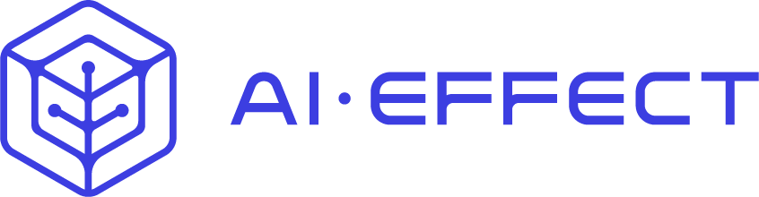

# Neural Network Verification of AC-OPF Proxies

**Minimizing worst-case violations of neural networks for AC Optimal Power Flow during training.**

For the first time, we verify all AC-OPF constraints of an AC-OPF proxy and minimize all worst-case violations during training. Read our paper now on [arXiv](https://arxiv.org/pdf/2510.23196)!

## 🔍 Overview

This repository contains the code for the **AC Verification** project, which focuses on **minimizing worst-case violations of neural networks for AC Optimal Power Flow (AC-OPF) during training**.

The project includes two main components:

- **MinMax:** Core logic for training neural networks and minimizing worst-case violations during training.
- **Verification:** Core logic for neural network verification.

The emphasis is on **minimizing worst-case violations during training** to increase trustworthiness of AC-OPF proxies.

---


## 📁 Repository Structure

Below is an overview of the repository, highlighting the most important folders and files.

```text
AC-OPF-verification/
├── MinMax/                              # Min–max training framework
│   ├── models/
│   │   └── best_models/                 # Trained model checkpoints (not tracked)
│   └── scripts/
│       └── training/
│           └── main_ac_train.py         # Main training script
│
├── verification/                        # Verification routines
│   └── lirpa_verification.py            # α-CROWN-based verification
│
├── docs/                                # Documentation assets (figures, logo)
├── .gitignore
├── README.md
```


## 🚀 Getting Started

To get started, please follow the instructions below.

```text
git clone https://github.com/bastiengiraud/AC-OPF-verification.git
```


## 📄 Citation

If you use this code in your research, please cite:
```bibtex
@article{giraud2025neural,
  title={Neural Networks for AC Optimal Power Flow: Improving Worst-Case Guarantees during Training},
  author={Giraud, Bastien and Nellikath, Rahul and Vorwerk, Johanna and Alowaifeer, Maad and Chatzivasileiadis, Spyros},
  journal={arXiv preprint arXiv:2510.23196},
  year={2025}
}
```

## AI-EFFECT

This work is partially funded by AI-EFFECT, a Testing and Experimentation Facility (TEF) for AI tools in the energy sector. Interested? Find us at https://ai-effect.eu/.




